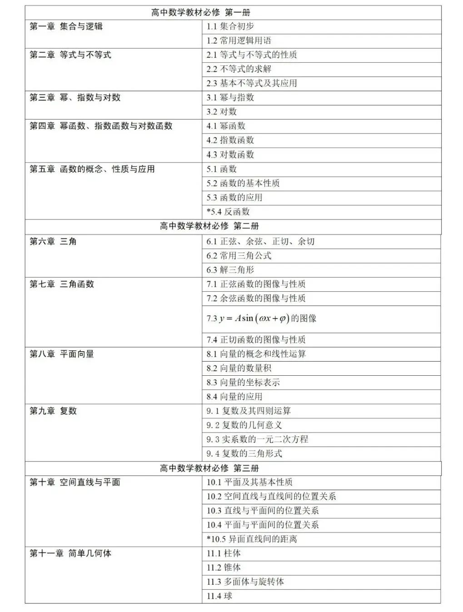
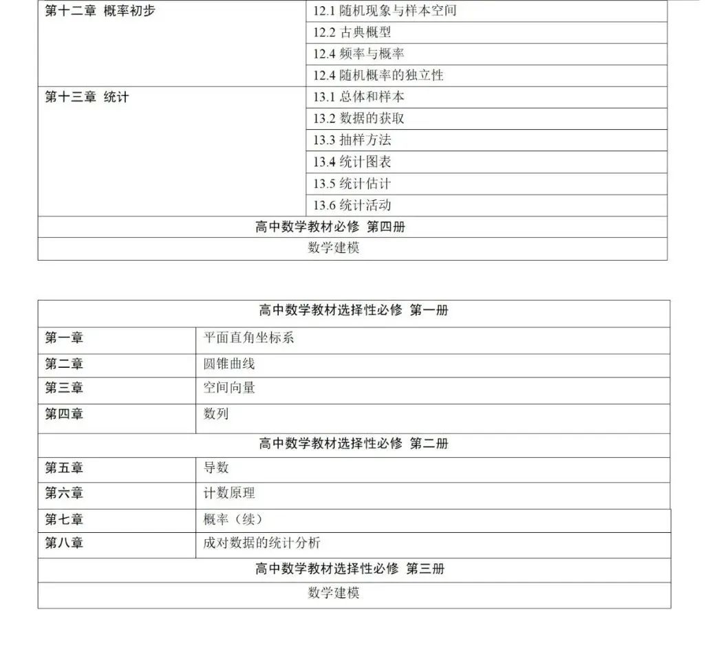

## 什么事高中数学

高中所学的数学绝大部分内容是300年前或更早的数学，集合论、线性规划、导数等少数知识点是为了与大学数学衔接而加入的近代数学基础知识。它的本质还是停留在对离散的、直观的、特殊规律的学习，但是已经开始朝将知识点一般化的方向延伸。例如高中学习的余弦定理是对勾股定理的推广，向量是对数的高维抽象，解析几何拓展了对平面几何问题的研究思路。

高中数学**以函数和方程为核心**，这是知识点编排的主线。如果撇去知识点细节，高中数学主要考察下列几个思想，这是高中数学解题思维的主线：

- 待定系数法
- 数形结合
- 从特殊到一般，将规律从特定多个推广到任意多个
- 换元与转化的思想

对于大多数资质一般、手头的优质教育资源很有限的人而言，数学是一门困难的学科，学习数学需要基于大量实践经验的方法总结。而且从高中数学开始，数学的学习难度会越来越大，答案或思路明显的问题会越来越少，时不时因遇到难题而发愁、学习感到吃力是很正常的。数学学习是无法回避困难的，如果习题都是一眼就能看出答案的程度，那么刷这样的水题再多也学不到数学的精髓。**读者在小学和中学低年级经常会遇到的那种大量的低思维层次、步骤高度重复化的无脑硬算计算练习根本不是数学的真面目。**数学的主要难点就是在于问题或方法有着看似无穷无尽的灵活变化，方法与方法之间也可以相互组合产生新的高级方法，这种**强大的变化性正是数学这个学科的本质特点之一，也是其生命力来源，应该主动面对、尽早适应**。即使是专业的数学工作者也经常遇到令人困惑不解的数学难题，或是被同行更优秀的工作所震惊。遇到困难时，一定要及时调整心态，不必死磕过难的题，也不必整日以泪洗面。

不是所有的难题都值得做，做完题之后要总结所做的题出得好不好，尤其是自己通过做完这样一道题目到底能不能学到新东西。对自己有启发性、自己特别容易出错的题目或考点要集中记下来。体会、收集和总结常见技巧在理工科课程学习中会变得越来越重要，要逐渐养成一个长期的习惯。做习题不是为了与他人攀比，而是检测自己对于新、旧知识的理解是否充分到位。**在数学中学到的思考方法，会内化为一种习惯抽象、联想、转化的思维本能，这是一种无形的智慧财富，能带来思维境界的提升。**不应该纯粹为了竞争而学习数学（这样未免格局偏小），这里给出2位著名数学家的话作为寄语：

> 数学并不是一项竞赛活动。——亚历山大·格罗滕迪克

> 数学的目标不是获得最高的排名、最高的分数或者最多的奖项，相反，最重要的目标是提升对数学的理解（不仅是为你自己，更为了你的同行、学生），以及促进数学的发展和应用。出于这个目的，数学欢迎任何想加入这个行列的人。——陶哲轩

祝大家能够通过高中及后续数学课程的学习，锻炼出好的数理思维能力，把这个美丽星球的智慧文明精华一代代传递、发展下去（有希望的话带到更远的星系）！

## 怎么学高中数学

沪教版高中数学教材共有4本必修+3本选修，课本资源可在
**https://www.aliyundrive.com/s/TXoLAfWWxRt 提取码：c6DE**中获得（编辑时选修2缺失，还在找:blush:）

以下是目录：

