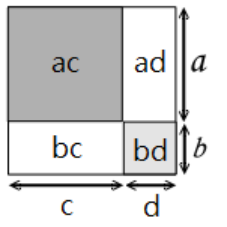

> 所谓初高中衔接，就是认清自己他妈的学不会这傻逼数学。

## 常用的乘法公式

### 平方差公式

$$
a^2-b^2=(a+b)(a-b)
$$
**↑”这个大家都知道，叫做平方差公式。但是你知道这个公式要如何推导吗？“（智将**

“哈哈，把(a+b)(a-b)拆开来不就行了，也就是我们平时用到的乘法分配律。”

**“那你知道乘法分配律是怎么来的吗？”**

“啊...这...”

$(a+b)(c+d)=ac+ad+bc+bd$

**"再看这张图，是不是一目了然"**

**我举这个例子的目的是为了告诉大家，无论学习什么，大家都要知其然，知其所以然。而不是靠死记硬背，那样远远没有到真正理解的地步。**

### 完全平方公式

$$
(a\pm{b})^2=a\pm2ab+b^2
$$

### 和立方和立方和

~~我去，绕口令（阴暗的爬行）~~

**和立方：**
$$
(a+b)^3=a\pm3a^2b+3ab\pm{b}^3
$$

推导过程：

**立方和：**

