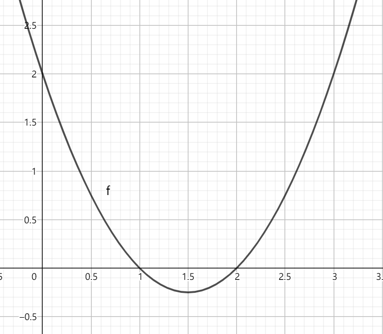

> 所谓初高中衔接，就是认清自己他妈的学不会这傻逼数学。

## 常用的乘法公式

### 平方差公式

### 完全平方公式

$$
(a\pm{b})^2=a\pm2ab+b^2
$$

### 和立方&立方和

~~我取，绕口令~~

**和立方：**

推导过程：

不难发现，和立方公式与完全平方公式有奇妙的联系。那么，(a+b)的n次方是多少呢？

我们可以借助杨辉三角：

动画：

杨辉三角形第n 层（顶层称第 0 层，第 1 行，第n 层即第 n+1 行，此处为包含 0 在内的自然数）正好对应于二项式  展开的系数。例如第二层 1 2 1 是幂指数为 2 的二项式展开形式的系数。比如第三行的1，2，1对应了完全平方公式中的系数1，2，1；第四行的1，3，3，1对应了和平方公式中的1，3，3，1；那么不难发现后面的规律了。注：±号标注在奇号位里。

**立方和：**

用**和立方**推导：

![=(x+y)\left[(x+y)^{2}-3xy\right]\,\!](https://wikimedia.org/api/rest_v1/media/math/render/svg/3bc61bdb20edf84a4973691f6064903308accd4b)

## 韦达定理

## 二次不等式

例：y=x2-3x+2>0

看到这个问题，你很有可能直接蒙圈了

不过我们只要画个图，问题就迎刃而解了

