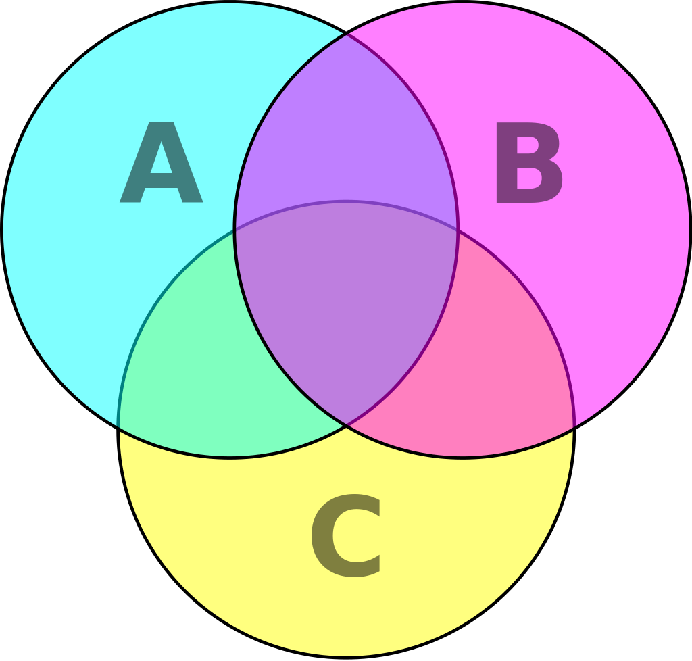
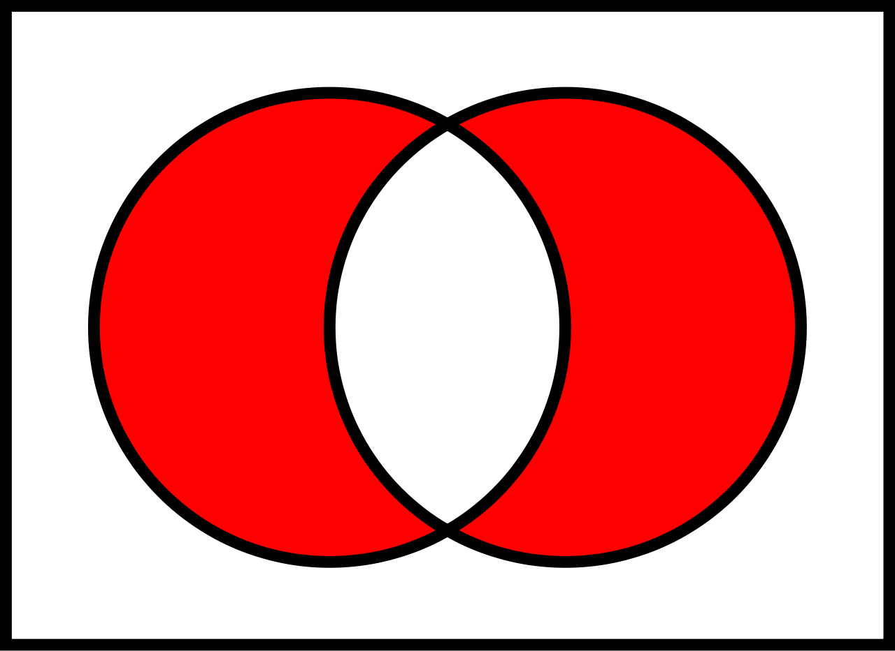

> 在班级里，我属于集合废物，我的补集属于学霸

## 集合的定义

简单来说，所谓的一个*集合*，就是将数个对象归类而分成为一个或数个形态各异的大小整体。 一般来讲，集合是具有某种特性的事物的整体，或是一些确认对象的汇集。构成集合的事物或对象称作“[元素](https://zh.wikipedia.org/wiki/元素_(數學))”或“成员”。集合的元素可以是任何事物，可以是人，可以是物，也可以是字母或数字等。

在数学交流当中为了方便，集合会有一些别名。比如：

- 族、系　通常指它的元素也是一些集合。

## 集合的符号

元素通常用等小写字母来表示；而集合通常用等大写字母来表示。

当元素属于集合时，记作。

当元素不属于集合时，记作。

如果两个集合所包含的元素完全一样，则二者相等，写作

### 集合的特性	

**无序性**：一个集合中，每个元素的地位都是相同的，元素之间是无序的。

- 集合上可以定义序关系，定义了序关系后，元素之间就可以按照序关系排序。但就集合本身的特性而言，元素之间没有必然的序。（参见序理论）

**互异性**：一个集合中，任何两个元素都认为是不相同的，即每个元素只能出现一次。

- 有时需要对同一元素出现多次的情形进行刻画，可以使用多重集，其中的元素允许出现多次。

**确定性**：给定一个集合，任给一个元素，该元素或者属于或者不属于该集合，二者必居其一，不允许有模棱两可的情况出现。

- 集合可以用文字或数学符号描述，称为**描述法**，比如：

- 集合的另一种表示方法是在大括号中列出其元素，称为**列举法**，比如：

尽管两个集合有不同的表示，它们仍可能是相同的。比如：上述集合中，而，因为它们正好有相同的元素。

元素列出的顺序不同，或者元素列表中有重复，都没有关系。比如：这三个集合，{和是相同的，同样因为它们有相同的元素。

这里必须要告诉大家一个超好用的东西：韦恩图：

## 子集与包含关系

 

 #### 定义

集合、，若，有。则称是的**子集**，亦称**包含于**，或**包含**，记作或，否则称不是的子集，记作或。

若，且，则称是的**真子集**，亦称**真包含于**，或**真包含**，记作或（有时也记作或）。

#### 基本性质

-包含关系   

 是集合间的一个非严格偏序关系 ，因为它有如下性质：

 **自反性**：集合，；（任何集合都是其本身的子集)

 **反对称性**：且；（这是证明两集合相等的常用手段之一)

  **传递性**：且；

- 真包含关系

   ”是集合间的一个 [严格偏序关系](https://zh.wikipedia.org/wiki/偏序关系#严格偏序，反自反偏序) ，因为它有如下性质：

- **反自反性**：集合，都不成立；

- **非对称性**：不成立；反之亦然；

- **传递性**：且；

\- 显然，包含关系，真包含关系定义了集合间的[偏序关系](https://zh.wikipedia.org/wiki/偏序关系)。而是这个偏序关系的**最小元素**，即：集合，；且若，则，（空集是任何集合的子集，是任何非空集合的真子集）

#### 举例

- 所有男人的集合是所有人的集合的[真子集](https://zh.wikipedia.org/wiki/真子集)。
- 所有自然数的集合是所有[整数](https://zh.wikipedia.org/wiki/整数)的集合的[真子集](https://zh.wikipedia.org/wiki/真子集)。
- 
- 

## 集合的运算

###  并

 两个集合可以相"加"。和的**并集**是将和的元素放到一起构成的新集合。

#### 定义

给定集合，，定义运算如下：或}。称为和的**并集**。

A 和 B 的并集

#### 示例
#### 基本性质
作为集合间的二元运算，运算具有以下性质。
- **[交换律](https://zh.wikipedia.org/wiki/交换律)**：；
- **[结合律](https://zh.wikipedia.org/wiki/结合律)**：；
- **[幂等律](https://zh.wikipedia.org/wiki/幂等律)**：；
- **[幺元](https://zh.wikipedia.org/wiki/幺元)**：集合，；（是运算的幺元）。
### 交
主条目：[交集](https://zh.wikipedia.org/wiki/交集)
一个新的集合也可以通过两个集合**均**有的元素来构造。和的**交集**，写作，是既属于的、又属于的所有元素组成的集合。
若，则和称作**不相交**。

A 和 B 的交集
#### 定义
给定集合、，定义运算如下：且}。称为和的**交集**。

#### 基本性质
作为集合间的二元运算，运算具有以下性质。
- **[交换律](https://zh.wikipedia.org/wiki/交换律)**：；
- **[结合律](https://zh.wikipedia.org/wiki/结合律)**：；
- **[幂等律](https://zh.wikipedia.org/wiki/幂等律)**：；
- **[空集合](https://zh.wikipedia.org/wiki/空集合)**：集合，；（是运算的空集合）。
其它性质还有：
- 

### 补集

两个集合也可以相"减"。在中的**相对补集**，国际上通常写作 ，中文教材中有时也会写作。表示属于的、但不属于的所有元素组成的集合。
在特定情况下，所讨论的所有集合是一个给定的全集的子集。这样， 称作的**绝对补集**，或简称**补集**（余集），写作或A}。

相对补集 A - B
补集可以看作两个集合相减，有时也称作**差集**。

#### 定义
给定集合，，定义运算-如下：且}。称为对于的**差集**，**相对补集**或**相对余集**。
在上下文确定了**全集**时，对于的某个子集，一般称为（对于）的**补集**或**余集**，通常记为或}}，也有记为}}, , A}，以及的。
#### 基本性质
作为集合间的二元运算，- 运算有如下基本性质：
- ；
- **右[幺元](https://zh.wikipedia.org/wiki/幺元)**：集合，；（是运算的右幺元）。
- **左[零元](https://zh.wikipedia.org/w/index.php?title=零元&action=edit&redlink=1)**：集合，；（是运算的左零元）。
#### 示例
### 对称差
#### 定义
给定集合，，定义**对称差**运算如下：。

实际上，这对称差就是这么个东西：

#### 基本性质
作为集合间的二元运算，运算具有如下基本性质：
- **[交换律](https://zh.wikipedia.org/wiki/交换律)**：；
- **[结合律](https://zh.wikipedia.org/wiki/结合律)**：；
- **[幺元](https://zh.wikipedia.org/wiki/幺元)**：集合，；（是运算的幺元）。
- **[逆元](https://zh.wikipedia.org/wiki/逆元)**：；

 

## 运算性质
集合的运算除了以上情况之外，集合间还具有以下运算性质：
- **[分配律](https://zh.wikipedia.org/wiki/分配律)**:

- 对偶律：

## 集合的元素个数
上述每一个集合都有确定的元素个数；比如：集合 *A* 有三个元素、而集合 *B* 有四个。一个集合中元素的数目称为该集合的[基数](https://zh.wikipedia.org/wiki/基数_(数学))。[数学写法](https://zh.wikipedia.org/w/index.php?title=數學寫法&action=edit&redlink=1)有很多种，在沪教版教材中使用cardA表示
集合可以没有元素。这样的集合叫做**空集**，用 符号表示。比如：集合是2004年所有住在月球上的人，它没有元素，则。在数学上，空集非常重要。更多资讯请参阅[空集](https://zh.wikipedia.org/wiki/空集)。
如果集合只含有限个元素，那么这个集合可以称为**有限集合**。
集合也可以有无穷多个元素，这样的集合称为**无限集合**。

