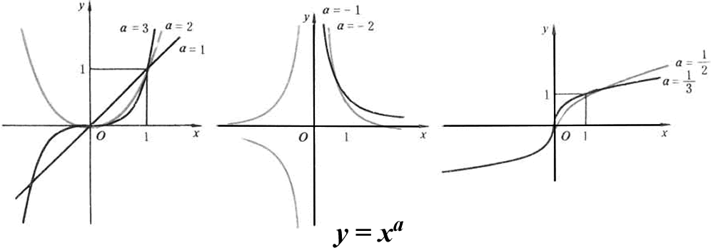

## 幂函数与单调函数

上面这个是幂函数，在课本中通过幂函数引入了单调函数的概念

函数*f*是**单调**的，如果只要*x* ≤ *y*，则*f*(*x*) ≤ *f*(*y*)。因此单调函数保持次序关系。

## 指数函数

**指数函数**是形式为的数学函数，其中是**底数**（或称**基数**，base），而是指数。

作为实数变量的函数，的图像总是正的（在轴之上）并递增（从左向右看），它不触及轴，尽管它可以任意程度的靠近它，即轴是这个图像的水平渐近线。一般的说，变量x可以是任何实数或[复数](https://zh.wikipedia.org/wiki/复数_(数学))，甚至是完全不同种类的数学对象。它的反函数是定义在所有正数上的自然对数。

## 对数函数

对数是幂运算的逆运算，对数函数与指数函数关于y=x对称，互为逆函数

对数函数的性质有：

1. 都过点；
2. 即y轴为其垂直渐近线。
3. 定义域为，值域为；
4. ，在、上是增函数；时，在上是减函数。
5. 当 时和交于三点；时交于一点；时交于两点；时交于一点；时则无交点。

## 反函数

设为一函数，其[定义域](https://zh.wikipedia.org/wiki/定义域)为，[值域](https://zh.wikipedia.org/wiki/值域)为。如果存在一函数，其定义域和值域分别为，并对每一有：  则称为的反函数，记之为
